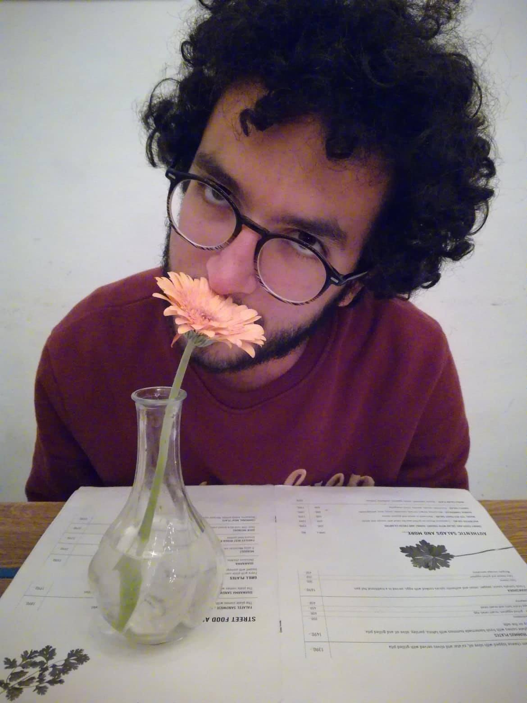

Hi! I am an MRes student at the [ENS](http://www.ens.fr), Paris. 

## Research Interest
I'm interested in human behavioural ecology, more precisely in evolutionary approaches of deprivation and behavioural history.

## Publications

1. B. de Courson, N. Baumard: Quantifying the scientific revolution ([text](https://osf.io/preprints/socarxiv/9ex8q), [data & code](https://github.com/regicid/Scientific_revolution))
2. B. de Courson, D. Nettle : Why inequalities and deprivation produce high crime and low trust ([code](https://github.com/regicid/Deprivation-antisociality/blob/master/Code.ipynb))

